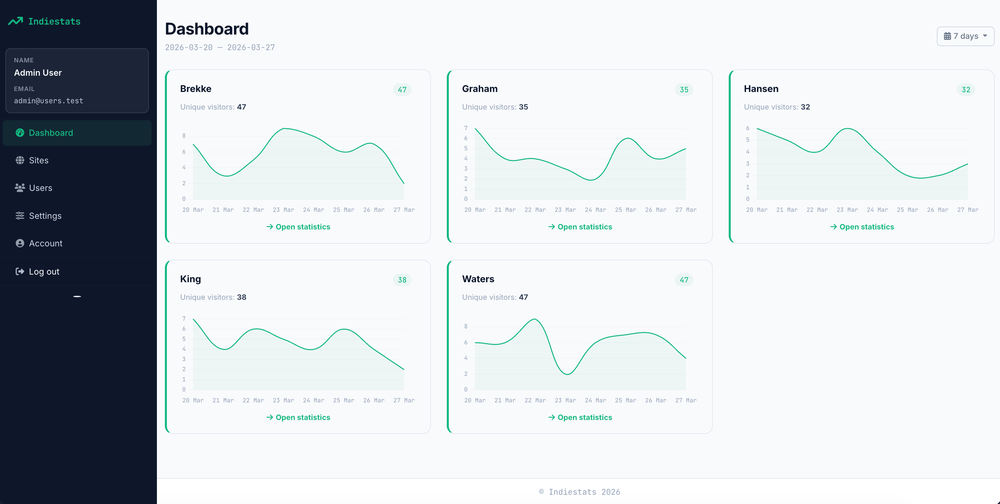
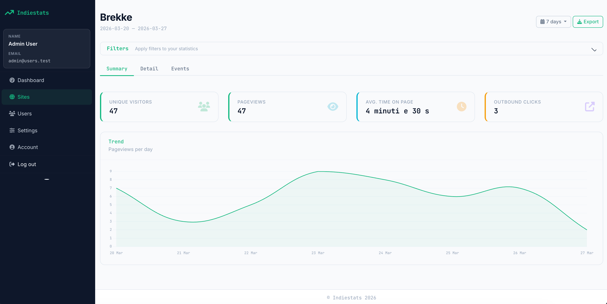
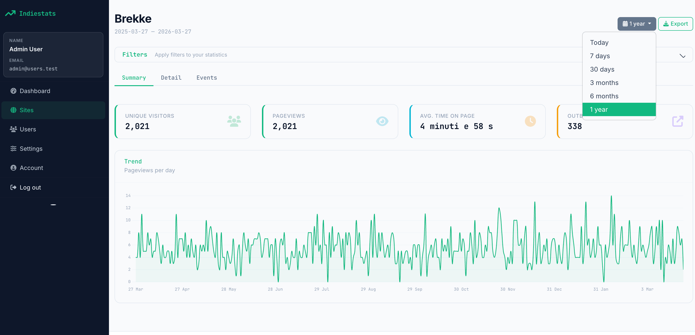
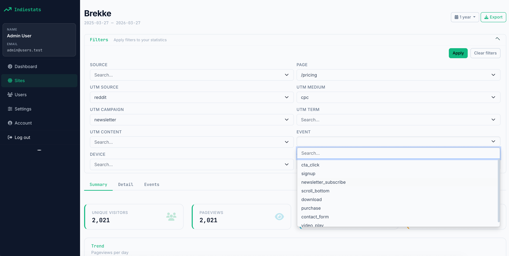
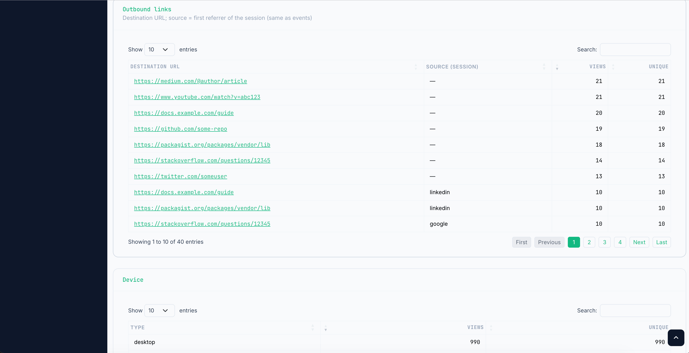
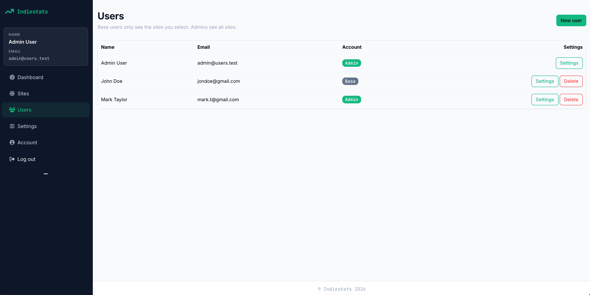
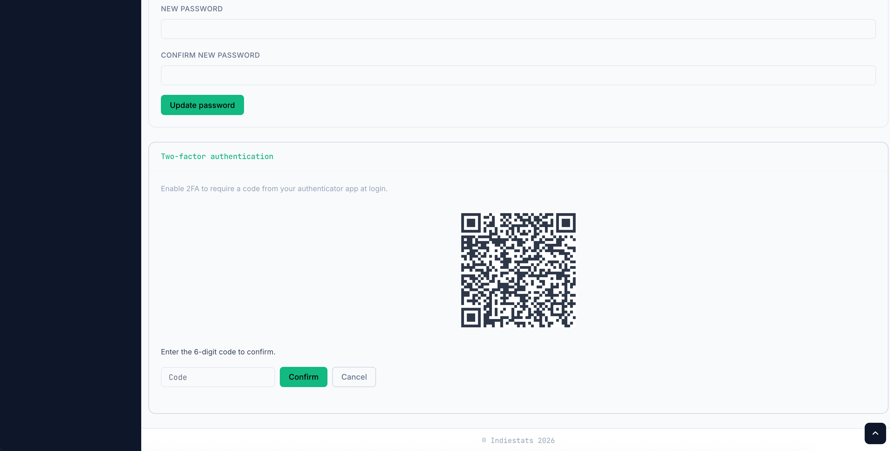

# IndieStats

Privacy-friendly, self-hosted web analytics built with [Laravel 13](https://laravel.com/docs/13.x). Each user manages **multiple sites**, each with a dedicated lightweight tracking snippet. No cookies, no consent banners required.

## Features

- **Pageview tracking** with localStorage-based visitor identification (no cookies)
- **Time on page** measurement (duration sent on tab hide / page unload)
- **Outbound click tracking** on external links
- **Custom event tracking** with up to 20 key-value properties per event
- **UTM parameter support** (source, medium, campaign, term, content)
- **Referrer & search query detection** with automatic source classification (Google, Bing, social, etc.)
- **Device, browser, OS and country detection** (GeoIP via MaxMind)
- **Noscript fallback** using a 1x1 tracking pixel
- **Goal management** to monitor specific custom events per site
- **Dashboard** with daily charts, date range selectors and advanced filters
- **Data export** to Excel (XLSX) via background jobs
- **Automatic data pruning** with configurable retention period (default: 375 days)
- **Multi-site support** with domain allowlisting per site
- **Localized UI**: analytics tables (DataTables) use your account language for labels, pagination, and number formatting
- **Branded error pages** for HTTP 403, 404, and 429, consistent with the app design

## Screenshots

<p align="center">
  
</p>
<p align="center"><em>Dashboard — traffic overview per site and date range</em></p>

<p align="center">
  
</p>
<p align="center"><em>Site analytics — summary metrics and charts</em></p>

<p align="center">
  
</p>
<p align="center"><em>Site analytics — additional breakdowns</em></p>

<p align="center">
  
</p>
<p align="center"><em>Filters — path, source, UTM, device, country, and more</em></p>

<p align="center">
  
</p>
<p align="center"><em>Detail tables — server-side paginated records with sorting</em></p>

<p align="center">
  
</p>
<p align="center"><em>Users (admin) — manage accounts and roles</em></p>

<p align="center">
  
</p>
<p align="center"><em>Account — password and two-factor authentication</em></p>

## Recent updates

- **Authentication**: email verification is not required to use the app (Fortify’s email-verification flow is disabled). You can still change email in account settings; `MAIL_*` is used for password reset and other mail.
- **Analytics tables**: DataTables strings are injected from Laravel translations and follow the signed-in user’s locale (same as the rest of the UI).
- **Error pages**: Custom 403 / 404 / 429 pages use the marketing layout and translated copy.
- **Demo seeding**: `DatabaseSeeder` creates an **admin** demo user (`admin@users.test` / `password`). Optional fake analytics data is still controlled with `SEED_FAKE_DATA=true` (see below).

## Requirements

| Software | Version |
|----------|---------|
| PHP | >= 8.3 |
| Composer | 2.x |
| Node.js | 20+ (recommended) |
| npm | 9+ |

Standard Laravel PHP extensions: `openssl`, `pdo`, `mbstring`, `tokenizer`, `xml`, `ctype`, `json`, `fileinfo`.

Database: **SQLite** (default), MySQL or PostgreSQL.

## Installation

### Quick Setup

```bash
git clone https://github.com/your-username/indiestats.git
cd indiestats
composer run setup
```

The `setup` script runs: `composer install`, `npm install`, `npm run build`, creates `.env` from `.env.example`, generates the app key, and runs migrations.

### Manual Installation

```bash
composer install
npm install
npm run build
cp .env.example .env
php artisan key:generate
touch database/database.sqlite   # only if using SQLite and file doesn't exist
php artisan migrate
```

### Seed Demo Data (Optional)

Add `SEED_FAKE_DATA=true` to your `.env`, then:

```bash
php artisan db:seed
```

This creates a demo **admin** user (`admin@users.test`, password `password`) and, when `SEED_FAKE_DATA=true`, populates the database with sample sites, pageviews, outbound clicks, events and goals. If you run `FakeDataSeeder` alone (e.g. in tests), an admin user with that email is created when missing.

## Configuration

### Environment Variables

| Variable | Description | Default |
|----------|-------------|---------|
| `APP_URL` | **Required in production.** Public URL of your instance (e.g. `https://stats.example.com`). The tracker script uses this to load `/i/{uuid}.js` and call `/collect/...` endpoints. | `http://localhost` |
| `APP_ENV` / `APP_DEBUG` | Set to `production` / `false` in production | `local` / `true` |
| `DB_CONNECTION` | Database driver (`sqlite`, `mysql`, `pgsql`) | `sqlite` |
| `QUEUE_CONNECTION` | Queue driver for background jobs (exports) | `database` |
| `GEOIP_DATABASE` | Absolute path to MaxMind GeoLite2-Country.mmdb for country stats | _(disabled)_ |
| `ANALYTICS_RETENTION_DAYS` | Days to keep raw analytics data before pruning | `375` |
| `TRACKING_EXTRA_ALLOWED_HOSTS` | Comma-separated extra hosts allowed for tracking (useful for local dev) | `localhost,127.0.0.1` (local env) |
| `MAIL_*` | Mail configuration (password reset, etc.) | `log` (local) |

### GeoIP (Country Detection)

To enable country-level statistics:

1. Register at [MaxMind](https://www.maxmind.com/) and download **GeoLite2 Country** (`.mmdb` format)
2. Set the path in `.env`:

```env
GEOIP_DATABASE=/absolute/path/to/GeoLite2-Country.mmdb
```

If not configured, country will be empty in stats — everything else works normally.

## Cron & Scheduled Commands

IndieStats uses Laravel's task scheduler for automated maintenance. Add this single cron entry to your server:

```cron
* * * * * cd /path-to-indiestats && php artisan schedule:run >> /dev/null 2>&1
```

### Scheduled Tasks

| Command | Schedule | Description |
|---------|----------|-------------|
| `analytics:prune` | Daily at 02:00 | Removes pageviews, tracking events, and outbound clicks older than the configured retention period (default: 375 days, ~1 year + 10 days margin) |

You can also run it manually at any time:

```bash
php artisan analytics:prune
```

**Note:** Goal definitions are never pruned — only raw pageview, event and outbound click records are removed.

## Queue Workers (Jobs)

IndieStats uses background jobs for generating Excel exports. You need a queue worker running to process them.

### Development

The dev server handles queue processing automatically:

```bash
composer run dev
```

### Production

Run a persistent queue worker:

```bash
php artisan queue:work --sleep=3 --tries=3
```

For reliability, use a process manager like **Supervisor**:

```ini
[program:indiestats-worker]
process_name=%(program_name)s_%(process_num)02d
command=php /path-to-indiestats/artisan queue:work --sleep=3 --tries=3
autostart=true
autorestart=true
numprocs=1
user=www-data
redirect_stderr=true
stdout_logfile=/path-to-indiestats/storage/logs/worker.log
```

## Managing Sites

### Adding a Site

1. Log in to your IndieStats instance
2. Navigate to **Sites** (`/sites`)
3. Enter a **name** for your site (e.g., "My Blog") — this is just a label for you
4. Enter the **allowed domains** (comma-separated, e.g., `example.com, www.example.com`)
   - Only pages served from these domains can send tracking data (validated via `Origin` / `Referer` header)
   - In production, always set allowed domains to prevent unauthorized use of your site key
5. Click **Add Site**

### Installing the Tracking Script

After creating a site, copy the provided embed code and paste it before the closing `</body>` tag on your website:

```html
<script async src="https://your-indiestats-url/i/xxxxxxxx-xxxx-xxxx-xxxx-xxxxxxxxxxxx.js"></script>
<noscript></noscript>
```

Replace `your-indiestats-url` with your actual `APP_URL`. The `.js` file is dynamically generated and contains the site's public key.

The script automatically tracks:
- **Pageviews** on every page load
- **Time on page** when the visitor leaves or switches tab
- **Outbound clicks** on links to external domains
- **UTM parameters** and **search queries** from the URL (`q`, `query`, `s` params)

### Custom Event Tracking

From your website's JavaScript, you can send custom events:

```javascript
// Basic event
indiestats.track('signup');

// Event with properties (up to 20 key-value pairs)
indiestats.track('purchase', {
    plan: 'pro',
    price: '29.99',
    currency: 'USD'
});
```

Property values can be strings, numbers or booleans. They are normalized to strings server-side.

### Deleting a Site

Navigate to **Sites**, open the site detail, and use the delete option. This removes the site and all associated analytics data.

## Using the Dashboard

### Overview Dashboard

The main **Dashboard** (`/dashboard`) shows all your sites at a glance:

- Unique visitors and total pageviews per site for the selected period
- Sparkline charts showing daily traffic trends
- Date range selector: today, 7 days, 30 days, 3 months, 6 months, 1 year, or custom range

### Site Detail View

Click on any site to access detailed analytics. The detail view has three tabs:

#### Summary Tab
- Key metrics: unique visitors, total pageviews, average time on page, outbound clicks
- Daily pageview chart
- Top pages, referrer sources, browsers, operating systems, device types, countries
- UTM source breakdown and search queries

#### Detail Tab
- Server-side paginated DataTables with full pageview records (UI language follows your account locale)
- Advanced filtering and search
- Sortable columns

#### Events Tab
- Custom tracking events grouped by name with counts and unique visitors
- **Goal management**: create goals by linking a label to an event name — the dashboard shows how many times that event fired and how many distinct visitors triggered it

### Filtering

Use the filter system to narrow analytics by:
- Page path
- Referrer source
- Browser, OS, device type
- Country
- UTM parameters (source, medium, campaign, term, content)

### Exporting Data

From the site detail view, click **Export** to generate an Excel (XLSX) file with your analytics data for the selected period and filters. The export is processed in the background — you'll be notified when it's ready for download.

## Public Endpoints (Reference)

| Method | Path | Description |
|--------|------|-------------|
| `GET` | `/i/{uuid}.js` | Tracker script (dynamically generated) |
| `POST` | `/collect/pageview` | Record a pageview |
| `POST` | `/collect/duration` | Update page duration |
| `POST` | `/collect/outbound` | Record an outbound click |
| `POST` | `/collect/event` | Record a custom event |
| `GET` | `/collect/pixel.gif` | Noscript fallback (limited tracking) |

All `/collect/*` POST routes are CSRF-exempt with open CORS to allow cross-origin requests from tracked sites. Rate limiting is applied (300 requests/minute for collect endpoints, 600/minute for the tracker script).

## Production Checklist

1. Set `APP_URL` to your final HTTPS URL
2. Set `APP_ENV=production` and `APP_DEBUG=false`
3. Set `allowed_domains` for every site to prevent key misuse
4. Configure the **cron** for `schedule:run` (see Cron section above)
5. Start a **queue worker** with Supervisor (see Queue Workers section above)
6. Run `php artisan config:cache` and `php artisan route:cache` after deploy
7. Run `npm run build` on every deploy that changes frontend assets
8. If behind a proxy/load balancer, configure Laravel's **trusted proxies** so `request()->ip()` returns the real visitor IP (needed for GeoIP)
9. Configure `MAIL_*` for password reset and other mail

## Deploying with Cipi

[Cipi](https://cipi.sh/) is an open-source CLI for Ubuntu VPS: LEMP stack, isolated apps, zero-downtime deploys, Let's Encrypt SSL, Supervisor workers and cron.

### Setup

```bash
# Install Cipi on your VPS (one-time)
wget -O - https://cipi.sh/setup.sh | bash

# Create an app
cipi app create
# Provide domain, git repo, branch, PHP version (>= 8.3)

# Deploy
cipi deploy myapp
```

### Frontend Build with Cipi

Cipi's default deploy pipeline does not include Node.js. You have two options:

**Option A — Install Node on the server** and add a custom task to `.deployer/deploy.php`:

```php
task('npm:build', function () {
    run('cd {{release_path}} && npm ci && npm run build');
});
after('deploy:vendors', 'npm:build');
```

**Option B — Build locally or in CI**, then copy `public/build/` to the server after deploy.

### SSL and Cron

```bash
cipi ssl install myapp
```

Add the Laravel scheduler cron for the app user as described in the Cron section above.

For more details, see the [Cipi documentation](https://cipi.sh/).

## Development

```bash
# Start development server (PHP server + queue worker + Vite)
composer run dev

# Code formatting
composer run lint

# Run tests
php artisan test --compact

# Build frontend
npm run build
```

## Tech Stack

- **Backend**: Laravel 13, PHP 8.3+
- **Frontend**: Bootstrap 5, Chart.js, DataTables, Tom Select, Font Awesome
- **Authentication**: Laravel Fortify (login, registration, password reset, optional two-factor authentication; email verification not enforced)
- **Database**: SQLite (default), MySQL/PostgreSQL supported
- **Queue**: Database driver (default), Redis supported
- **GeoIP**: MaxMind GeoLite2 (optional)
- **Export**: PhpSpreadsheet (XLSX)

## License

IndieStats is released under the [MIT License](LICENSE).
